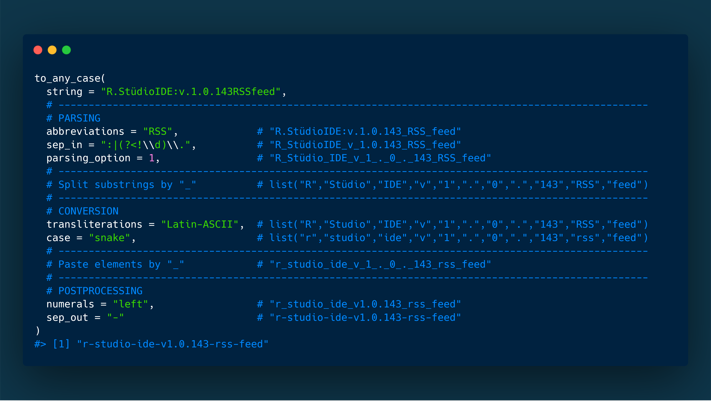

# snakecase 

[](https://ci.appveyor.com/project/Tazinho/snakecase) [](https://travis-ci.org/Tazinho/snakecase) [](https://cran.r-project.org/package=snakecase) [](https://codecov.io/github/Tazinho/snakecase?branch=master) [](http://cranlogs.r-pkg.org/) [](http://cranlogs.r-pkg.org/) [](https://www.tidyverse.org/lifecycle/#stable)


## Overview 

The snakecase package introduces a fresh and straightforward approach on case conversion, based upon a consistent design philosophy.

For a short intro regarding typical use cases, see the blog article [Introducing the snakecase package](http://www.malte-grosser.com/post/introducing-the-snakecase-package/).

### Install and load

```{r, results='hide', message=FALSE, warning=FALSE, eval = TRUE}
# install snakecase from cran
# install.packages("snakecase")

# or the (stable) development version hosted on github
# install.packages("remotes")
remotes::install_github("Tazinho/snakecase")

# load snakecase
library(snakecase)
```

### Basic usage

The workhorse function of this package is `to_any_case()`. It converts strings (by default) into snake case:

```{r, collapse = TRUE}
string <- c("lowerCamelCase", "ALL_CAPS", "I-DontKNOWWhat_thisCASE_is")

to_any_case(string)
```

However, one can choose between many other cases like i.e. `"lower_camel"`, `"upper_camel"`, `"all_caps"`, `"lower_upper"`, `"upper_lower"`, `"sentence"` and `"mixed"`, which are based on `"parsed"` case:

```{r, collapse = TRUE}
to_any_case(string, case = "parsed")
```

Also shortcuts (wrappers around `to_any_case()`) are provided:

```{r, collapse = TRUE}
to_upper_camel_case(string)
```

Be aware that automatic case conversion depends on the input string and it is therefore recommended to verify the results. You might want to pipe these into `dput()` and hardcode name changes instead of blindly trusting the output:

```{r, collapse = TRUE}
library(magrittr)

to_snake_case(c("SomeBAdInput", "someGoodInput")) %>% dput()
```

### Big picture (a parameterized workflow)

The `to_any_case()` function basically enables you to convert any string into any case. This is achieved via a well thought process of __parsing__ (`abbreviations`, `sep_in`, `parsing_option`), __conversion__ (`transliterations`, `case`) and __postprocessing__ (`numerals`, `sep_out`). The specific arguments allow you to customize the pipeline.

On this example, you can see the whole pipeline including some implementation details.

```{r echo=FALSE, out.width='100%'}
# knitr::include_graphics('./man/figures/Workflow01.PNG')

```

Some further **cosmetics** (`unique_sep`, `empty_fill`, `prefix`, `postfix`) can be applied to the output, see arguments.

## Arguments

**string**: A character vector, containing the input strings.

#### Parsing

**abbreviations**: One challenge in case conversion are odd looking "mixed cases". These might be introduced due to country codes or other abbreviations, which are usually written in upper case. Before you consider a different `parsing_option` (see below), you might just want to use the `abbreviations` argument:

```{r, collapse = TRUE}
to_snake_case(c("HHcity", "IDTable1", "KEYtable2", "newUSElections"),
              abbreviations = c("HH", "ID", "KEY", "US"))
```

Abbreviations are consistently turned into upper case for title-, mixed-, lower-camel- and upper-camel-case.

**sep_in**: By default non-alphanumeric characters are treated as separators:

```{r, collapse = TRUE}
to_snake_case("malte.grosser@gmail.com")
```

To suppress this behaviour, just set `sep_in = NULL`:

```{r, collapse = TRUE}
to_snake_case("malte.grosser@gmail.com", sep_in = NULL)
```

Since `sep_in` takes regular expressions as input, `to_any_case()` becomes very flexible. We can for example express that dots behind digits should not be treated as separators, since they might be intended as decimal marks:

```{r, collapse = TRUE}
to_snake_case("Pi.Value:3.14", sep_in = ":|(?<!\\d)\\.")
```

**parsing_option**: We can modify the abbreviations example a bit. In this case, another parsing option might be handy:

```{r, collapse = TRUE}
to_snake_case(c("HHcity", "IDtable1", "KEYtable2", "newUSelections"),
              parsing_option = 2)
```

To suppress conversion after a non-alphanumeric character (except `"_"`), you can choose parsing option 3:

```{r, collapse = TRUE}
to_upper_camel_case("look_AfterThe-hyphen andThe.dot",
                    sep_in = NULL,
                    parsing_option = 3)
```

If you are interested in a specific parsing option, which is not implemented, please open an issue.

#### Conversion

**transliterations**: To turn special characters (for example) into ASCII one can incorporate transliterations from `stringi::stri_trans_list()` or [this package](https://github.com/Tazinho/snakecase/issues/107) (also in combination):

```{r, collapse = TRUE}
to_upper_camel_case("Doppelgänger is originally german",
                    transliterations = "german")

to_snake_case("Schönes Café",
              transliterations = c("german", "Latin-ASCII"))
```

Additionally it is easy to specify tranliterations or more general any replacement as a named element of the character vector supplied to the `transliterations` argument:

```{r, collapse = TRUE}
to_screaming_snake_case("the_boy_likes_snake_case",
            transliterations = c("boy" = "baby", "snake" = "screaming_snake"))

to_snake_case("column names 100 % snake case", sep_in = NULL, 
              transliterations = c("%" = "percent"), postfix = ";-)")
```

If you can provide transliterations for your (or any other) country, please drop them within [this issue](https://github.com/Tazinho/snakecase/issues/107).

**case**: The desired target case, provided as one of the following:

* snake_case: `"snake"`
* lowerCamel: `"lower_camel"` or `"small_camel"`
* UpperCamel: `"upper_camel"` or `"big_camel"`
* ALL_CAPS: `"all_caps"` or `"screaming_snake"`
* lowerUPPER: `"lower_upper"`
* UPPERlower: `"upper_lower"`
* Sentence case: `"sentence"`
* Title Case: `"title"` - This one is basically the same as sentence case with, but in addition it is wrapped into `tools::toTitleCase()` and abbreviations are always turned into upper case.

There are six "special" cases available:

* `"parsed"`: This case is underlying all other cases. Every substring a string consists of becomes surrounded by an underscore (depending on the parsing_option). Underscores at the start and end are trimmed. No lower or upper case pattern from the input string are changed.
* `"mixed"`: Almost the same as `case = "parsed"`. Every letter which is not at the start or behind an underscore is turned into lowercase. If a substring is set as an abbreviation, it will be turned into upper case.
* `"swap"`: Upper case letters will be turned into lower case and vice versa. Also `case = "flip"` will work. Doesn't work with any of the other arguments except `unique_sep`, `empty_fill`, `prefix` and `postfix`.
* `"random"`: Each letter will be randomly turned into lower or upper case. Doesn't work with any of the other arguments except `unique_sep`, `empty_fill`, `prefix` and `postfix`.
* `"none"`: Neither parsing nor case conversion occur. This case might be helpful, when one wants to call the function for the quick usage of the other parameters. To suppress replacement of spaces to underscores set `sep_in = NULL`. Works with `sep_in`, `transliterations`, `sep_out`, `unique_sep`, `empty_fill`, `prefix` and `postfix`.
* `"internal_parsing"`: This case is returning the internal parsing (suppressing the internal protection mechanism), which means that alphanumeric characters will be surrounded by underscores. It should only be used in very rare use cases and is mainly implemented to showcase the internal workings of `to_any_case()`.

#### Postprocessing

**numerals**: If you want to format the alignment of numerals use `numerals` (`"middle"` (default), `"left"`, `"right"`, `"asis"` or `"tight"`). I.e. to add no extra separators around digits use:

```{r, collapse = TRUE}
to_snake_case("species42value 23month 7-8",
              numerals = "asis")
```

**sep_out**: For the creation of other well known or completely new cases it is possible to adjust the output separator (`sep_out`):

```{r, collapse = TRUE}
to_snake_case(string, sep_out = ".")

to_mixed_case(string, sep_out = " ")

to_screaming_snake_case(string, sep_out = "=")
```

When `length(sep_out) > 1`, its last element gets recycled and the output separators are incorporated per string according the order in `sep_in`. This might come in handy when i.e. formatting file names:

```{r, collapse = TRUE}
to_any_case(
  string = c("YYYY_MM.DD_bla_bla_bla",
             "2019_01-09_bla_bla_bla"),
  sep_out = c("", "", "-", "_"),
  postfix = ".txt")
```

#### Cosmetics

**unique_sep**: (character): When not `NULL` non unique output strings will get an integer suffix separated with the supplied string.  

**empty_fill**: (character): Empty output (`""`) will be replaced by this string.

**prefix**: (character): simple prefix.

**postfix**: (character): simple post-/suffix.

<!-- When it is clear that they are separators, you can supply them as a regex to the `sep_in` argument

```{r, collapse = TRUE}
to_any_case(names(iris), sep_in = "\\.")
```

It is as simple as that to treat all non-alphanumerics as separators

```{r, collapse = TRUE}
to_any_case("malte.grosser@gmail.com", sep_in = "[^[:alnum:]]")
```

With a bit of regex knowledge you can decide to leave in whatever you want, while removing the rest

```{r, collapse = TRUE}
to_any_case("keep @ # . , * remove - & |",
            sep_in = "[^[:alnum:] @#\\.,\\*]")
```

The regex format is especially handy, when special characters have a meaning as a separator or for example as a decimal mark

```{r, collapse = TRUE}
to_any_case("Pi.Value:3.14", sep_in = ":|(?<!\\d)\\.")
```

Of course other cases are supported (`case`) and output separators can be adjusted (`sep_out`)

```{r, collapse = TRUE}
to_any_case(names(iris), sep_in = "\\.", case = "upper_camel", sep_out = " ")
```

All of the cases like snake, lower_camel, upper_camel, all_caps, lower_upper, upper_lower and mixed are based on parsed case

```{r, collapse = TRUE}
to_any_case("THISIsHOW IAmPARSED!", case = "parsed")
```

Shortcut wrappers like `to_snake_case()`, `to_lower_camel_case()` etc. are available.-->

## Design decisions

### Scope

`to_any_case()` is an attempt to provide good low level control, while still being high level enough for daily usage. For another example of case conversion with good default settings, you can look into the `clean_names()` function from the [janitor](https://github.com/sfirke/janitor) package, which works directly on data frames. You can also look into the [sjPlot](https://github.com/strengejacke/sjPlot) package, where automatic case conversion is used to provide nice default labels within graphics.

For daily usage (especially when preparing fixed scripts) I recommend to combine `to_any_case()` with `dput()`. In this way, you can quickly inspect, if the output is as intended and hardcode the results (which is basically safer and good practice in my opinion). In very complex cases you might just want to manually fix the output from `dput()` instead of tweeking with the arguments too much.

### Dependencies, vectorisation, speed and special input handling

The package is internally build up on the [stringr](https://github.com/tidyverse/stringr) package, which means that many powerful features are provided "by default":

* `to_any_case()` is vectorised over most of its arguments like `string`, `sep_in`, `sep_out`, `empty_fill`, `prefix` and `postfix`.
* internal character operations are super fast c++. However, some speed is lost due to a more systematic and maintainable implementation.
* special input like `character(0)`, `NA` etc. is handled in exactly the same consistent and convenient manner as in the stringr package.

### Known limitations

* In general combinations of one letter words or abbreviations are hard to convert back from cases with `""` as default separator:

    ```{r, collapse=TRUE}
    to_any_case("a_b_c_d", case = "upper_camel")
    ```
    
  However, it it not impossible: 
  
    ```{r, collapse= TRUE}
    to_snake_case("ABCD", sep_out = ".",
                  transliterations = c("^ABCD$" = "A_B_C_D"))
    
    to_snake_case("BVBFCB:5-2", sep_in = ":",
                  transliterations = c("^BVBFCB" = "BVB_FCB"))
    ```

* Sometimes further pre- or postprocessing might be needed. For example you can easily write your own parsing via a sequence of calls like `str_replace_all(string, (some_pattern), "_\\1_")`.

* You can decide yourself: Open an issue [here](https://github.com/Tazinho/snakecase/issues) or build sth. quickly yourself via packages like base, [stringr](https://github.com/tidyverse/stringr), [stringi](https://github.com/gagolews/stringi) etc.

<!--`to_any_case()` is an attempt to provide good low level control, while still being high level enough for daily usage. If you want case conversion with good default settings, you can choose the `clean_names()` function from the [janitor](https://github.com/sfirke/janitor) package, which works directly on data frames. You can also look into the [sjPlot](https://github.com/strengejacke/sjPlot) package, where automatic case conversion is used to provide nice default labels within graphics.

For daily usage (especially when preparing fixed scripts) I recommend to combine `to_any_case()` with `dput()`. In this way, you can quickly inspect, if the output is as intended and hardcode the results (which is basically safer and good practice in my opinion). In very complex cases you might just want to manually fix the output instead of tweeking with the arguments too much.

However, if you have a really hard time on a specific example or you want to have appropriate settings for a specific usecase, the following might help you getting started...

* `abbreviations`: In the wild you might meet abbreviations like country codes, which are often written in upper case and can lead to odd looking "mixed cases". Before you consider a different `parsing_option`, you might just want to use the `abbreviations` argument

```{r, collapse = TRUE}
to_any_case(c("HHcity", "IDTable1", "KEYtable2", "newUSElections"),
            abbreviations = c("HH", "ID", "KEY", "US"))
```

* `sep_in`: Very ofthen you might just want to have all special (non-alphanumeric) characters as a separator. You can achive this while providing the regarding regex

```{r, collapse = TRUE}
to_any_case("so.many_different@separators inThis|sentece",
            sep_in = "[^[:alnum:]]")
```

* You may want to do exactly the last thing, but for a specific reason "." and "@" are not meant to be input separators

```{r, collapse = TRUE}
to_any_case("some-email@provider.com", 
            sep_in = "[^[:alnum:]|^\\.|^@]")
```

* `parsing_option`: We can modify the abbreviations example a bit. In this case, another parsing option might be handy

```{r, collapse = TRUE}
to_any_case(c("HHcity", "IDtable1", "KEYtable2", "newUSelections"),
            parsing_option = 2)
```

* To suppress conversion after a non-alphanumeric character (except "_"), you can choose parsing option 3

```{r, collapse = TRUE}
to_any_case("look_AfterThe-hyphen andThe.dot", 
            case = "upper_camel", parsing_option = 3)
```

If you are interested in a specific parsing option, which is not implemented, pls open an issue.

* `transliterations`: To transliterate exotic characters you can use any option from `stringi::stri_trans_list()` (especially "Latin-ASCII" is useful) or provided lookups introduced (country specific) by this package. Currently only "german" is supported. When more than one is supplied, the transliterations are performed iteratively

```{r, collapse = TRUE}
to_any_case("Schönes Café", 
            transliterations = c("german", "Latin-ASCII"))
```

If you can provide tranliterations for your (or any other) country, pls drop them within [this issue](https://github.com/Tazinho/snakecase/issues/107).

* `case`: Sometimems you just need a reasonable case. Make sure to checkout

```{r, collapse = TRUE}
to_any_case("parsed_case", case = "parsed")

to_any_case("My_first_LettersWONTChange", case = "mixed")

to_any_case("IalsoWORKWith abbreviations", case = "mixed", 
            abbreviations = c("I", "WORK"))

to_any_case("IWill LookLike aRollerCoasterYouCanPARSEMeWith option2",
            case = "upper_lower") # or lower_upper

to_any_case("Maybé you_just...want to Format me a bit?", case = "none",
            sep_in = "_|\\.", transliterations = "Latin-ASCII",
            sep_out = " ")
```

* cosmetics: `empty_fill`, `unique_sep`, `prefix`, `postfix`

```{r, collapse=TRUE}
to_any_case(c("","",""), empty_fill = c("empty", "empty", "also empty"))

to_any_case(c("same", "same", "same", "other"), unique_sep = c(">"))

to_any_case(c("customer", "product"), case = "big_camel", 
            prefix = c("table_1.", "table_2."),
            postfix = c("ID"))
```

-->
## Design Philosophy

### Practical influences

Conversion to a specific target case is not always obvious or unique. In general a clean conversion
can only be guaranteed, when the input-string is meaningful.

Take for example a situation where you have IDs for some customers. Instead of calling the column "CustomerID" you abbreviate it to "CID". Without further knowledge about the meaning of CID it will be impossible to know that it should be converted to "c_id", when using `to_snake_case()`. Instead it will be converted to:

```{r, collapse=TRUE}
to_snake_case("CID")
```

We could have also converted to "c_i_d" and if we don't know the meaning of "CID", we can't decide which one is the better solution. However, it is easy to exclude specific approaches by counterexamples. So in practice it might be nicer to convert "SCREAMING_SNAKE_CASE" to "screaming_snake_case" instead of "s_c_r_e_a_m_i_n_g_s_n_a_k_e_c_a_s_e" (or "screamin_g_snak_e_cas_e" or "s_creaming_s_nake_c_ase"), which means that also "cid" is preferable to "c_i_d" (or "c_id" or "ci_d") without further knowledge.

Since the computer can't know, that we want "c_id" by himself. It is easiest, if we provide him with the right information (here in form of a valid PascalCase syntax):

```{r, collapse=TRUE}
to_snake_case("CId")
```

In this way it is guaranteed to get the correct conversion and the only chance of an error lies in an accidentally wrong provided input string or a bug in the converter function `to_snake_case()` (or a sequence of (one letter) abbreviations, see known limitations).

### Consistent behaviour

In many scenarios the analyst doesn't have a big influence on naming conventions and sometimes there might occur situations where it is not possible to find out the exact meaning of a variable name, even if we ask the original author. In some cases data might also have been named by a machine and the results can be relatively technically. So in general it is a good idea to compare the input of the case converter functions with their output, to see if the intended meanings at least seem to be preserved.

To make this as painless as possible, it is best to provide a logic that is robust and can handle also relatively complex cases. Note for example the string "RStudio". How should one convert it to snake case? We have seen a similar example with "CId", but for now we focus on sth. different. In case of "RStudio", we could convert to: 

1. "r_s_tudio",
1. "rs_tudio" or
1. "r_studio".

If we are conservative about any assumptions on the meaning of "RStudio", we can't decide which is the correct conversion. It is also not valid to assume that "RStudio" was intentionally written in PascalCase. Of course we know that "r_studio" is the correct solution, but we can get there also via different considerations. Let us try to convert our three possible translations (back) to PascalCase and from there back to snake case. What should the output look like?

1. r_s_tudio -> RSTudio -> r_s_t_udio
1. rs_tudio  -> RsTudio -> rs_tudio
1. r_studio  -> RStudio -> r_studio

Both of the first two alternatives can't be consistently converted back to a valid Pascal case input ("RStudio") and with the first logic the further snake case conversion seems to be complete nonsense. Only the latter case is consistent, when converting back to PascalCase, which is the case of the input "RStudio". It is also consistent to itself, when converting from PascalCase back to snake_case.  

In this way, we can get a good starting point on how to convert specific strings to valid snake_case. Once we have a clean snake_case conversion, we can easily convert further to smallCamelCase, BigCamelCase, SCREAMING_SNAKE_CASE or anything else.

### Three rules of consistency

In the last sections we have seen, that it is reasonable to bring a specific conversion from an input string to some standardized case into question. We have also seen, that it is helpful to introduce some tests on the behavior of a specific conversion pattern in related cases. The latter can help to detect inappropriate conversions and also establishes a consistent behavior when converting exotic cases or switching between standardized cases. Maybe we can generalize some of these tests and introduce some kind of consistency patterns. This would enable us that whenever inappropriate or non-unique possibilities for conversions appear, we have rules that help us to deal with this situation and help to exclude some inconsistent conversion alternatives.

During the development of this package I recognized three specific rules that seem reasonable to be valid whenever cases are converted. To be more general we just use `to_x()` and `to_y()` to refer to any two differing converter functions from the set of functions including `to_snake_case()`, `to_screaming_snake_case()`, `to_lower_camel_case` and `to_upper_camel_case()`. (Other cases like "lower_upper" or "upper_lower" could be included, if we consider `parsing_option = 2` within the equations.)

1. When we have converted to a standardized case, a new conversion to the case should not change the output:

    `to_x(to_x(string)) = to_x(string)`  

1. When converting to a specific case, it should not matter if a conversion to another case happened already:

    `to_y(to_x(string)) = to_y(string)`  

1. It should always be possible to switch between different cases, without any loss of information:  

    `to_x(to_y(to_x(string))) = to_x(string)`  

Note that it can easily be shown, that rule three follows from the second rule. However, it seems reasonable to express each by its own, since they all have an interpretation and together they give a really good intuition about the properties of the converter functions.

## Testing

To give a meaningful conversion for different cases, we systematically designed test-cases for conversion to snake, small- and big camel case among others.
To be consistent regarding the conversion between different cases, we also test the rules above on all test-cases.
<!--Note that equality in this equation is only one criterion and it still doesn't
imply a unique solution on how to translate an initial string argument to snake or camel case. (Note that also `to_xxx(string) = to_xxx(string)` seems desirable). However, for the 
following testcases, also these two equations are tested.-->

```{r, echo = FALSE, include = FALSE}
cases <- c(NA, "snake_case", "snakeCase",
           "SnakeCase", "_", "snake_Case",
           "_", "SNake", "Snake",
           "s_nake", "sn_ake",  "_",
           "SNaKE", "SNaKEr", "s_na_k_er",
           "_", "SNAKE SNAKE CASE", "_",
           "snakeSnakECase", "SNAKE snakE_case", "_",
           "ssRRss", "ssRRRR")            

# cases <- c(NA,
#            "snake_case", "snakeCase",
#            "SnakeCase", "_", "snake_Case", 
#            "_", "SNake", "Snake",
#            "s_nake", "sn_ake", "_",
#            "SNaKE", "SNaKEr", "s_na_k_er", "_",
#            "SNAKE SNAKE CASE", "_",
#            "snakeSnakECase", "SNAKE snakE_case", "_",
#            "bangBooMBang",
#            "upPER", "CId", "_",
#            "___", ".", "...",
#            "Sepal.Width", "Var 1", "Var-2",
#            "Var.3", "Var4",
#            "SnakeCase",
#            "Snake-Case",
#            "Snake Case",
#            "Snake  -  Case")
# 
# `As intended?` = c("yes", "yes", "yes",
#                                                "yes", "", "yes",
#                                                "", "yes", "yes",
#                                                "yes", "yes", "",
#                                                "yes", "yes", "yes",
#                                                "", "yes", "yes",
#                                                "yes", "", "yes",
#                                                "_ ?", "",
#                                                "_ X",
#                                                "_ X", "_ ? (maybe c_id)", "_ ?",
#                                                "_ ?", "_ ?", "_ ?",
#                                                "_ X", "_ ? (maybe var1)", "_ ?", 
#                                                "_ ? (maybe var3)", "_ X",
#                                                "","")

knitr::kable(tibble::tibble(nr = seq_along(cases),
                            examples = cases,
                            snake_case = snakecase::to_snake_case(cases),
                            #snake_case_dev = snakecase::to_snake_case_dev(cases),
                            smallCamelCase = snakecase::to_lower_camel_case(cases),
                            BigCamelCase = snakecase::to_upper_camel_case(cases)
                            )
             )
```

## Related Resources

* If you are interested on (the history of) this package, you can watch this [(older) talk](https://www.youtube.com/watch?v=T6p0l8XzP64).
* [The state of naming conventions in R, Bååth 2012, R Journal](https://lup.lub.lu.se/search/publication/e324f252-1d1c-4416-ad1f-284d4ba84bf9) [Download article](journal.r-project.org/archive/2012-2/RJournal_2012-2_Baaaath.pdf)
* [Consistent naming conventions in R, Lovelace 2014, RBloggers](https://www.r-bloggers.com/consistent-naming-conventions-in-r/)
* [What is your preferred style for naming variables in R?, Stackoverflowquestion 2009](http://stackoverflow.com/questions/1944910/what-is-your-preferred-style-for-naming-variables-in-r)
* [Are there any official naming conventions in R?, stackoverflowquestion 2012](http://stackoverflow.com/questions/10013545/are-there-any-official-naming-conventions-for-r)
* [`clean_names()` function](https://github.com/sfirke/janitor/blob/master/R/clean_names.R) from the [janitor package](https://github.com/sfirke/janitor)
* [`to_camel()` function](https://github.com/Rapporter/rapportools/blob/master/R/utils.R) from the [rapporttools package](https://github.com/Rapporter/rapportools)
* [lettercase-pkg](https://cran.r-project.org/web/packages/lettercase/index.html)

---

Please note that the _snakecase_ package is released with a [Contributor Code of Conduct](.github/CODE_OF_CONDUCT.md). By contributing to this project, you agree to abide by its terms.