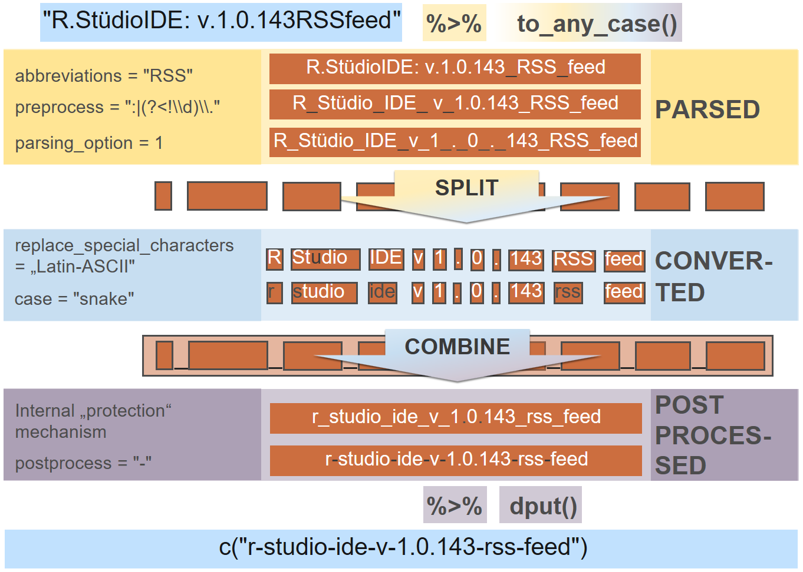

# snakecase 

[](https://ci.appveyor.com/project/Tazinho/snakecase)
[](https://travis-ci.org/Tazinho/snakecase)
[](https://cran.r-project.org/package=snakecase)
[](https://codecov.io/github/Tazinho/snakecase?branch=master)
[](http://cranlogs.r-pkg.org/)
[](http://cranlogs.r-pkg.org/)

## Overview

<!--A small package with functions to convert column names of data.frames (or strings
in general) to different cases like snake_case, smallCamel- and BigCamelCase among others. Also high level features for more advanced case conversions are provided via `to_any_case()`.-->

The snakecase package introduces a fresh and straightforward approach on
case conversion of strings, based upon a concise design philosophy.

(If you are interested on (the history of) this package, you can watch
this [(older) talk](https://www.youtube.com/watch?v=T6p0l8XzP64).)

### Install

``` r
# install snakecase from cran
# install.packages("snakecase")

# or the (stable) development version hosted on github
install.packages("devtools")
devtools::install_github("Tazinho/snakecase")
```

### Basic examples

Default case is snake case

``` r
library(snakecase)
to_any_case("veryComplicatedString")
## [1] "very_complicated_string"
```

Dots and other special characters may have a special intention

``` r
to_any_case("malte.grosser@gmail.com")
## [1] "malte.grosser@gmail.com"
```

When it is clear that they are separators, you can supply them as a
regex to the `preprocess` argument

``` r
to_any_case(names(iris), preprocess = "\\.")
## [1] "sepal_length" "sepal_width"  "petal_length" "petal_width" 
## [5] "species"
```

This is especially handy, when special characters have a meaning as a
separator or for example as a decimal mark

``` r
to_any_case("Pi.Value:3.14", preprocess = ":|(?<!\\d)\\.")
## [1] "pi_value_3.14"
```

Of course other cases are supported (`case`) and separators can be
adjusted
(`postprocess`)

``` r
to_any_case(names(iris), preprocess = "\\.", case = "upper_camel", postprocess = " ")
## [1] "Sepal Length" "Sepal Width"  "Petal Length" "Petal Width" 
## [5] "Species"
```

And you might want to remove special characters along the way

``` r
to_any_case("Doppelgänger is originally german", 
            replace_special_characters = "german", case = "upper_camel")
## [1] "DoppelgaengerIsOriginallyGerman"
```

All of the cases like: snake, lower\_camel, upper\_camel, all\_caps,
lower\_upper, upper\_lower and mixed are based on parsed case

``` r
to_any_case("THISIsHOW IAmPARSED!", case = "parsed")
## [1] "THIS_Is_HOW_I_Am_PARSED!"
```

Be aware that automatic case conversion depends on the input string and
it is recommended to verify the results. So you might want to pipe these
into `dput()` (and hardcode name changes instead of blindly trusting
`to_any_case()`’s output)

``` r
dput(to_any_case(c("SomeBAdInput", "someGoodInput")))
## c("some_b_ad_input", "some_good_input")
```

### Big picture (a parameterized workflow)

The `to_any_case()` function is the workhorse of the package and
basically enables you to convert any string into any case via a well
thought process of **parsing** (`abbreviations`, `preprocess`,
`parsing_option`), **conversion** (`replace_special_characters`, `case`)
and **postprocessing** (`postprocess`). The specific arguments allow you
to customize the pipeline.

On this example, you can see the pipeline including all implementation
details.



Some further cosmetics can be added to the output via the following
arguments:

  - `unique_sep` (character): When not `NULL` non unique will get an
    integer suffix separated with the supplied string  
  - `empty_fill` (character): Empty output (`""`) will be replaced by
    this string  
  - `prefix` (character): simple prefix  
  - `postfix` (character): simple post-/suffix

### Vectorisation, speed and special input handling

The package is internally build up on the
[stringr](https://github.com/tidyverse/stringr) package, which means
that many powerful features are provided “by default”:

  - `to_any_case()` is vectorised over most of its arguments like
    `string`, `preprocess`, `postprocess`, `empty_fill`, `prefix` and
    `postfix`.
  - internal character operations are super fast c++. However, a lot of
    speed is lost due to a more systematic and maintainable
    implementation. (This might be optimized in the long run)
  - special input like `character(0)`, `NA` etc. is handled in exactly
    the same consistent and convenient manner as in the stringr package

## Recommended settings

`to_any_case()` is an attempt to provide good low level control, while
still being high level enough for daily usage. If you want case
conversion with good default settings, you can choose the
`clean_names()` function from the
[janitor](https://github.com/sfirke/janitor) package, which works
directly on data frames. You can also look into the
[sjPlot](https://github.com/strengejacke/sjPlot) package, where
automatic case conversion is used to provide nice default labels within
graphics.

For daily usage (especially when preparing fixed scripts) I recommend to
combine `to_any_case()` with `dput()`. In this way, you can quickly
inspect, if the output is as intended and hardcode the results (which is
basically safer and good practice in my opinion). In very complex cases
you might just want to manually fix the output instead of tweeking with
the arguments too much.

However, if you have a really hard time on a specific example or you
want to have appropriate settings for a specific usecase, the following
might help you getting started…

  - `abbreviations`: In the wild you might meet abbreviations like
    country codes, which are often written in upper case and can lead to
    odd looking “mixed cases”. Before you consider a different
    `parsing_option`, you might just want to use the abbreviations
    argument

<!-- end list -->

``` r
to_any_case(c("HHcity", "IDTable1", "KEYtable2", "newUSElections"),
            abbreviations = c("HH", "ID", "KEY", "US"))
## [1] "hh_city"          "id_table_1"       "key_table_2"     
## [4] "new_us_elections"
```

  - `preprocess`: Very ofthen you might just want to have all special
    (non alpha numeric) characters as a separator. You can achive this
    while providing the regarding regex

<!-- end list -->

``` r
to_any_case("so.many_different@separators inThis|sentece",
            preprocess = "[^[:alnum:]]")
## [1] "so_many_different_separators_in_this_sentece"
```

  - You may want to do exactly the last thing, but for a specific reason
    you don’t want to preprocess “.” and “@”

<!-- end list -->

``` r
to_any_case("some-email@provider.com", 
            preprocess = "[^[:alnum:]|\\.|@]") # notice: the order is important
## [1] "some_email@provider.com"
```

  - `parsing_option`: We can modify the abbreviations example a bit. In
    this case, another parsing option might be handy

<!-- end list -->

``` r
to_any_case(c("HHcity", "IDtable1", "KEYtable2", "newUSelections"),
            parsing_option = 2)
## [1] "hh_city"          "id_table_1"       "key_table_2"     
## [4] "new_us_elections"
```

  - To suppress conversion after a non alpha numeric character (except
    “\_“), you can choose parsing option 5

<!-- end list -->

``` r
to_any_case("look_AfterThe-hyphen andThe.dot", 
            case = "upper_camel", parsing_option = 5)
## [1] "LookAfterThe-hyphenAndThe.dot"
```

If you are interested in a specific parsing option, which is not
implemented, pls open an issue.

  - `replace_special_characters`: To transliterate exotic characters you
    can use any option from `stringi::stri_trans_list()` (especially
    “Latin-ASCII” is useful) or provided lookups introduced (country
    specific) by this package. Currently only “german” is supported.
    When more than one is supplied, the transliterations are performed
    iteratively

<!-- end list -->

``` r
to_any_case("Schönes Café", 
            replace_special_characters = c("german", "Latin-ASCII"))
## [1] "schoenes_cafe"
```

If you can provide tranliterations for your (or any other) country, pls
drop them within [this
issue](https://github.com/Tazinho/snakecase/issues/107).

  - `case` Sometimems you just need a reasonable case. Make sure to
    checkout

<!-- end list -->

``` r
to_any_case("parsed_case", case = "parsed")
## [1] "parsed_case"

to_any_case("My_first_LettersWONTChange", case = "mixed")
## [1] "My_first_Letters_Wont_Change"

to_any_case("IalsoWORKWith abbreviations", case = "mixed", abbreviations = "WORK")
## [1] "Ialso_WORK_With_abbreviations"

to_any_case("IWill LookLike aRollerCoasterYouCanPARSEMeWith option2",
            case = "upper_lower") # or lower_upper
## [1] "IwillLOOKlikeArollerCOASTERyouCANparseMEwithOPTION2"

to_any_case("Maybé you_just...want to Format me a bit?", case = "none",
            preprocess = "_|\\.", replace_special_characters = "Latin-ASCII",
            postprocess = " ")
## [1] "Maybe you just want to Format me a bit?"
```

  - cosmetics: `empty_fill`, `unique_sep`, `prefix`, `postfix`

<!-- end list -->

``` r
to_any_case(c("","_",""), empty_fill = c("empty", "also empty"))
## Warning in string[string == ""] <- empty_fill: Anzahl der zu ersetzenden
## Elemente ist kein Vielfaches der Ersetzungslänge
## [1] "empty"      "also empty" "empty"

to_any_case(c("same", "same", "same", "other"), unique_sep = c(">"))
## [1] "same"   "same>1" "same>2" "other"

to_any_case(c("customer", "product"), case = "big_camel", 
            prefix = c("table_1.", "table_2."),
            postfix = c("ID"))
## [1] "table_1.CustomerID" "table_2.ProductID"
```

  - In general combinations of one letter words are hard to convert back
    from cases with `""` as default separator

<!-- end list -->

``` r
to_any_case("a_b_c_d", case = "upper_camel")
## [1] "ABCD"
```

  - Sometimes further pre or postprocessing might be needed. You can
    decide yourself: Open an issue
    (here)\[<https://github.com/Tazinho/snakecase/issues>\] or build
    sth. quickly yourself via packages like base,
    (stringr)\[<https://github.com/tidyverse/stringr>\],
    (stringi)\[<https://github.com/gagolews/stringi>\] etc.

## Design Philosophy

### Practical influences

Conversion to a specific target case is not always obvious or unique. In
general a clean conversion can only be guaranteed, when the input-string
is meaningful.

Take for example a situation where you have IDs for some customers.
Instead of calling the column “CustomerID” you abbreviate it to “CID”.
Without further knowledge about the meaning of CID it will be impossible
to know that it should be converted to “c\_id”, when using
`to_snake_case()`. Instead it will be converted to:

``` r
to_snake_case("CID")
## [1] "cid"
```

We could have also converted to “c\_i\_d” and if we don’t know the
meaning of “CID”, we can’t decide which one is the better solution.
However, it is easy to exclude specific approaches by counterexamples.
So in practice it might be nicer to convert “SCREAMING\_SNAKE\_CASE” to
“screaming\_snake\_case” instead of
“s\_c\_r\_e\_a\_m\_i\_n\_g\_s\_n\_a\_k\_e\_c\_a\_s\_e” (or
“screamin\_g\_snak\_e\_cas\_e” or “s\_creaming\_s\_nake\_c\_ase”),
which means that also “cid” is preferable to “c\_i\_d” (or “c\_id” or
“ci\_d”) without further knowledge.

Since the computer can’t know, that we want “c\_id” by himself. It is
easiest, if we provide him with the right information (here in form of a
valid PascalCase syntax):

``` r
to_snake_case("CId")
## [1] "c_id"
```

In this way it is guaranteed to get the correct conversion and the only
chance of an error lies in an accidentally wrong provided input string
or a bug in the converter function `to_snake_case()`.

### Consistent behaviour

In many scenarios the analyst doesn’t have a big influence on naming
conventions and sometimes there might occur situations where it is not
possible to find out the exact meaning of a variable name, even if we
ask the original author. In some cases data might also have been named
by a machine and the results can be relatively technically. So in
general it is a good idea to compare the input of the case converter
functions with their output, to see if the intended meanings at least
seem to be preserved.

To make this as painless as possible, it is best to provide a logic that
is robust and can handle also relatively complex cases. Note for example
the string “RStudio”. How should one convert it to snake case? We have
seen a similar example with “CId”, but for now we focus on sth.
different. In case of “RStudio”, we could convert to:

1.  “r\_s\_tudio”,
2.  “rs\_tudio” or
3.  “r\_studio”.

If we are conservative about any assumptions on the meaning of
“RStudio”, we can’t decide which is the correct conversion. It is
also not valid to assume that “RStudio” was intentionally written in
PascalCase. Of course we know that “r\_studio” is the correct solution,
but we can get there also via different considerations. Let us try to
convert our three possible translations (back) to PascalCase and from
there back to snake case. What should the output look like?

1.  r\_s\_tudio -\> RSTudio -\> r\_s\_t\_udio
2.  rs\_tudio -\> RsTudio -\> rs\_tudio
3.  r\_studio -\> RStudio -\> r\_studio

Both of the first two alternatives can’t be consistently converted back
to a valid Pascal case input (“RStudio”) and with the first logic the
further snake case conversion seems to be complete nonsense. Only the
latter case is consistent, when converting back to PascalCase, which is
the case of the input “RStudio”. It is also consistent to itself, when
converting from PascalCase back to snake\_case.

In this way, we can get a good starting point on how to convert specific
strings to valid snake\_case. Once we have a clean snake\_case
conversion, we can easily convert further to smallCamelCase,
BigCamelCase, SCREAMING\_SNAKE\_CASE or anything else.

### Three rules of consistency

In the last sections we have seen, that it is reasonable to bring a
specific conversion from an input string to some standardized case into
question. We have also seen, that it is helpful to introduce some tests
on the behavior of a specific conversion pattern in related cases. The
latter can help to detect inappropriate conversions and also establishes
a consistent behavior when converting exotic cases or switching between
standardized cases. Maybe we can generalize some of these tests and
introduce some kind of consistency patterns. This would enable us that
whenever inappropriate or non-unique possibilities for conversions
appear, we have rules that help us to deal with this situation and help
to exclude some inconsistent conversion alternatives.

During the development of this package I recognized three specific rules
that seem reasonable to be valid whenever cases are converted. To be
more general we just use `to_x()` and `to_y()` to refer to any two
differing converter functions from the set of fucntions including
`to_snake_case()`, `to_screaming_snake_case()`, `to_lower_camel_case`
and `to_upper_camel_case()`. (Other cases like “lower\_upper” or
“upper\_lower” could be included, if we consider `parsing_option = 2`
within the equations.)

1.  When we have converted to a standardized case, a new conversion to
    the case should not change the output:
    
    `to_x(to_x(string)) = to_x(string)`

2.  When converting to a specific case, it should not matter if a
    conversion to another case happened already:
    
    `to_y(to_x(string)) = to_y(string)`

3.  It should always be possible to switch between different cases,
    without any loss of information:
    
    `to_x(to_y(to_x(string))) = to_x(string)`

Note that it can easily be shown, that rule three follows from the first
and the second rule. However, it seems reasonable to express each by its
own, since they all have an interpretation and together they give a
really good intuition about the properties of the converter functions.

## Testing

To give a meaningful conversion for different cases, we systematically
designed test-cases for conversion to snake, small- and big camel case
among others. To be consistent regarding the conversion between
different cases, we also test the rules above on all test-cases.
<!--Note that equality in this equation is only one criterion and it still doesn't
imply a unique solution on how to translate an initial string argument to snake or camel case. (Note that also `to_xxx(string) = to_xxx(string)` seems desirable). However, for the 
following testcases, also these two equations are tested.-->

## Related Resources

  - [The state of naming conventions in R, Bååth 2012, R
    Journal](https://lup.lub.lu.se/search/publication/e324f252-1d1c-4416-ad1f-284d4ba84bf9)
    [Download
    article](journal.r-project.org/archive/2012-2/RJournal_2012-2_Baaaath.pdf)
  - [Consistent naming conventions in R, Lovelace 2014,
    RBloggers](https://www.r-bloggers.com/consistent-naming-conventions-in-r/)
  - [What is your preferred style for naming variables in R?,
    Stackoverflowquestion 2009](http://stackoverflow.com/questions/1944910/what-is-your-preferred-style-for-naming-variables-in-r)
  - [Are there any official naming conventions in R?,
    stackoverflowquestion 2012](http://stackoverflow.com/questions/10013545/are-there-any-official-naming-conventions-for-r)
  - [`clean_names()`
    function](https://github.com/sfirke/janitor/blob/master/R/clean_names.R)
    from the [janitor package](https://github.com/sfirke/janitor)
  - [`to_camel()`
    function](https://github.com/Rapporter/rapportools/blob/master/R/utils.R)
    from the [rapporttools
    package](https://github.com/Rapporter/rapportools)
  - [lettercase-pkg](https://cran.r-project.org/web/packages/lettercase/index.html)
